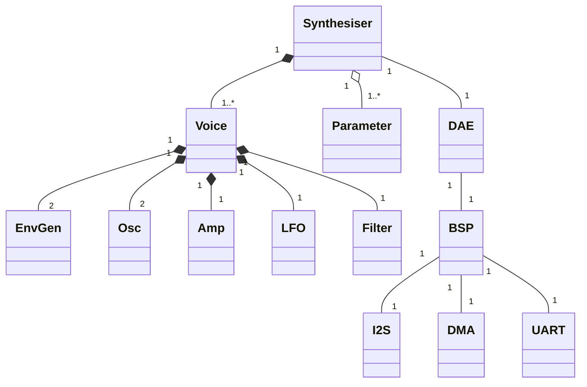

# Frugi
Frugi, meaning frugal, is an 8-voice digital VA synthesiser for the STM32F411xe. 

- **Voicing**
  - Polyphonic (8 voices)
  - Velocity sensitive
  - Oldest note voice steal.

- **Sound Generation**
  - Dual oscillator with classic VA waveforms (saw, triangle, pulse).
  - Pulse width variable on pulse wave.
  - Antialised (polynomial BLEP)

- **Sound Shaping**
  - Multi-tap ladder style filter (LP4/2,BP4/2,HP4/2)
  - Filter saturation.

- **Modulation**
  - LFO (inspired by the Yamaha CS20M) with 5 waveforms including sample & hold.
  - Two envelope generators (one for volume, one for modulation)
  - Flexible envelope modes (normal, biased, inverted, biased inverted)  

Employs ```FreeRTOS``` for deterministic task scheduling with an interrupt driven audio engine.

Support is provided for:

- STM32F411CE "Blackpill" generic board.
- STM32F411-DISCO STM Discovery board.

The specfic board is selected in the ```CMakeLists.txt``` file.

#### Board Support (BSP)
The ```bsp``` folder contains the board support package for the supported development boards.  This includes managing the low-level DMA, I2S and other peripherals.

You will need to implement your own ```board.c``` and ```board.h``` if you use a board other than those listed above.

#### Digital Audio Engine (DAE)
The ```dae``` folder contains the Digital Audio Engine.  This provides:

- Audio Processing Thread (task)
- Double buffered output (I2S), DMA driven.
- MIDI parser (UART)
- Parameter store (transient).

The DAE calls weak functions that must be overriden by the synthesiser.  

*Note that ```  dae_process_block()``` generates a continuous 440Hz sine approximation if not overriden, this is useful for checking board bring-up.*

See the ```tasks.c``` file for the overrides.

#### User Interface (UI)
The ```ui``` folder implements a simple LED strobe task, this serves to show the UI thread is alive but otherwise has no functionality.

Synthesiser parameters are mapped to MIDI CC messages:

```c
{
   /*CC, Function */
    {20, OSC1_WAVE},
    {21, OSC1_OCTAVE},
    {22, OSC1_SEMI},
    {23, OSC1_CENTS},
    {24, OSC1_LEVEL},
    {25, OSC1_MOD_SOURCE},
    {26, OSC1_MOD_DEPTH},

    {30, OSC2_WAVE},
    {31, OSC2_OCTAVE},
    {32, OSC2_SEMI},
    {33, OSC2_CENTS},
    {34, OSC2_LEVEL},
    {35, OSC2_MOD_SOURCE},
    {36, OSC2_MOD_DEPTH},

    {42, FILTER_TYPE},        
    {MIDI_CC_FREQUENCYCUTOFF, FILTER_CUTOFF},
    {MIDI_CC_RESONANCE, FILTER_RESONANCE},
    {44, FILTER_MOD_SOURCE},
    {46, FILTER_MOD_DEPTH},
    {47, FILTER_SATURATION},
    
    {MIDI_CC_VOLUME, AMP_VOLUME},
    {53, AMP_MOD_SOURCE},
    {54, AMP_MOD_DEPTH},
    {55, AMP_ENV_ATTACK},
    {56, AMP_ENV_DECAY},        
    {57, AMP_ENV_SUSTAIN},
    {58, AMP_ENV_RELEASE},
    {84, AMP_ENV_VEL_SENS},
    {85, AMP_ENV_NOTE_TRACK},

    {60, LFO_RATE},
    {61, LFO_TRIGGER_MODE}
};
```

#### Synthesiser

The oscillator uses Polynomial BLEP anti-aliasing for the Saw/Pulse waves, this is lightweight and works well with classic cyclic waves on a constained device.  

The triangle wave does not use any anti-aliasing, when testing, I could hear little difference between using DPW anti-aliasing and not, so I decided to save the cycles.

The oscillators can be detuned to thicken up the sound and include a soft saturation to add a little edge.

The LFO is loosely based on the vintage Yamaha CS20M, it generates 5 waveforms simultaneously.

Each destination (oscillator, filter, amplifier) can use a different waveform (modulation source) and depth, but they all share the same rate. The LFO can be free-running or triggered when you play a note.

The modulation routing is fixed.  Each module can choose a modulation source and depth but it will be applied to a pre-defined parameter:

- Oscillator : Pitch
- Filter : Cutoff
- Amp : Level (in addition to the Amplifier Envelope)

Modulation sources can select from the LFO waves or modulation envelope generator.  

The envelope generators are vintage style RC style with non-linear segments.

The envelope velocity tracking might feel strange if you're used to modern synthesisers.  This is a VA synth so like many vintage synthesisers, it scales the attack rate of the amplifier envelope by the note velocity, it doesn't alter the volume level of the sound.  If you want it to do this then just scale the output level of the amplifier by the same velocity scaling factor.  

The envelope also has decay rate scaled by note pitch (MIDI note),  higher notes will decay faster. 

The filter is a Moog Ladder style with taps for LP, BP and HP at both 2 and 4 poles. This is based on the Oberheim variant.  The filter is resonant with saturation to tame some of the resonance, it can be a little startling at times.  This is not a refined filter ;)


### Compile time variables.
There are a number of #defines (set using -D compiler switch) in the CMakeFile.txt which will alter aspects of the build:

| Setting | Purpose |
| ------- | ------- |
| DIM_OUTPUT | This lowers (dims) the output level by 75% |
| SATURATION_FEEDBACK | Applies filter saturation to the feedback path only|
| SATURATION_TANH | A typical hyper-tan filter saturation |
| SATURATION_TANH_APPROX | An approximation of tanh filter saturation|
| OSC_SOFT_SATURATION | Applies a soft clip to the oscillator output for a little analogue feel |
| DAE_BLOCK_SIZE | The number of samples in the audio block |
| DAE_SAMPLE_RATE | 44100, 48000 or 96000 |
| DAE_IS_USING_MCLOCK | Set this if your DAC needs a master clock as well as I2S |
| UART_POLLED | This switches from interrupt driven to polled UART.  The debugger seems not to disable interrupts during single stepping and ends up stuck in the interrupt handler so switching to polled is useful.  I'm told that SEGGER claims to fix this but it still had this problem with my J-Link.|


### Architecture


#### Optimisation
The code has been hand-optimised to some degree in addition to leveraging the excellent GCC optimisation.  I've drawn the line at using any assembly staying with C.

This leads to some untidy looking code which looks jarring to some developers, especially those not used to working with constrained embedded devices.  

In particular:
- many loops are unrolled (using repeated code)
- ```for``` loops are replaced by ```while``` loops with pointer arithmetic.
- function pointers (jump-tables) are used to avoid conditional logic.
- variables are copied from memory to locals (stack caching)
- math is often restructured to avoid division and multiplication.
- common DSP values are precomputed as constants.

Plus ad-hoc others that I've forgotten or aren't worth calling out.

An unfortunate aspect of this is that some code can be hard to understand at first glance.

#### Approximate Timings

At 48000kHz with a block size of 120, @100MHz we have 2500us in which to generate and transmit our sample data 
(1/48000 * 120 * 100MHz) 

These timings, taken using the DWT cycle timer are approximate but accurate within a few microseconds.

The DAE needs 75us when all is idle (sending sample values of 0 to the DAC). The output accumulator in the synth 
accounts for 42us of that, the remaining 33us are used by the DAE processing loop.  These overheads are 
mainly caused by memory copying as data is accumulated into buffers and transformed from float to integers, 
the DAE uses DMA for the data transfer to the I2S so this does not incurr much of a cost.  Since the STM32F411
has no data cache or coupled RAM we're limited in what can be done to improve this.

A typical voice (both oscillators, both envelopes, filter and LFO active) takes around 220us.  

All 8 voices sounding shows a total DAE block time of 1825us.

This leaves a margin of 675us for other functions unrelated to audio generation.  A reasonable margin.


#### Building

You probably already have the STM32 toolchain if you're checking out this project, but just in case:

You'll need either the `stm32cubeclt` command line tools or the `STM32CubeIDE`. The project files are set up for the command line tools.

When this was written, I was using version 1.18.0, installed at the default locations:
- `/opt/st/stm32cubeclt_1.18.0` (Linux)
- `C:\ST\stm32cubeclt_1.18.0` (Windows)

You might need to update some paths in the toolchain cmake file if your's differ:
- `<project>/cmake/stm_arm_gcc.cmake`

If you're using VS Code, also check the paths in:
- `<project>/.vscode/launch.json`
- `<project>/.vscode/tasks.json`

### Using VS Code (The Easy Way)

VS Code is the simplest way to work with the template. Launch files and task configurations are ready to go for both Windows and Linux.

Make sure to open VS Code from the main `<project>` folder!

You'll need these VS Code extensions:

| Extension | Author |
| ------ | ------ |
| Cortex-Debug (for debugging only) | marus25 | 
| CMake Tools | Microsoft | 
| C/C++ Extension Pack | Microsoft |
| Embedded Tools | Microsoft |

### Setting Up the Project

From the command palette (Ctrl+P), run:
- `CMake: Select Configure Preset` (pick debug or release)
- `CMake: Delete Cache & Reconfigure`

### Building the Project

From the command palette:
- `CMake: Clean Rebuild` or `CMake: Build`

### Uploading to Your Board

You'll need either:
- An ST-Link probe
- A J-Link probe

I've included tasks for both (press Ctrl+Shift+J to see the task list):
- J-Link Flash (Linux)
- J-Link Flash (Win)
- ST-Link Flash (Linux)
- ST-Link Flash (Win)

These tasks look for the STM32 tools in the specific folders previously mentioned - check the paths in `.vscode/tasks.json` if you run into issues.

You can also use STM32CubeIDE for flashing if you prefer.

### Debugging

Launch configurations for debugging are in the `.vscode/launch.json` file:
- JLink-Debug (Linux)
- JLink-Debug (Win)
- STLink-Debug (Linux)
- STLink-Debug (Win)

Getting debugging working in VS Code can sometimes be tricky, but these configurations work for me. If you have trouble, there's plenty of help online.

*Note: if you are using a Nucleo or Discovery board, I recommend converting the onboard ST-Link into a J-Link which allows you to use the Segger RTT Tracing provided in the source code.  This is easy to do and free, see the [Segger ST-LINK on-board web page](https://www.segger.com/products/debug-probes/j-link/models/other-j-links/st-link-on-board/).*

## Who am I?
I am what is impolitely, but totally correctly, referred to as a "graybeard".

I've been an embedded engineer on and off for over 40 years. I've worked with Motorola,Zilog, Hitachi, ARM and a swathe of now long-forgotten microcontrollers in that time.

These days I'm a, so called,  architect and my main role is to draw pictures for others to do the coding, which is why I do this, like most programmers, I find hands-on coding both enjoyable and creative.

I'm also a musician, once classically trained,who was seduced by the wages in 1983 to switch career. I performed as a keyboardist until the early 2000s and I've worked with many, now vintage, synthesisers during that time.

Audio DSP is a hobby, it merges my two careers which I find exciting and challenging. As I head into retirement I need something to keep my brain active and this is ideal.

So be warned, I may be a little further ahead on the learning curve than some of you reading this but I don't claim to be a good, or even efficient, Audio DSP programmer.

## System Requirements

- STM32F411 Microcontroller (Cortex M4F)
- Audio DAC interface (I2S)

## License

MIT License - Copyright (c) 2025 YDigiKat


