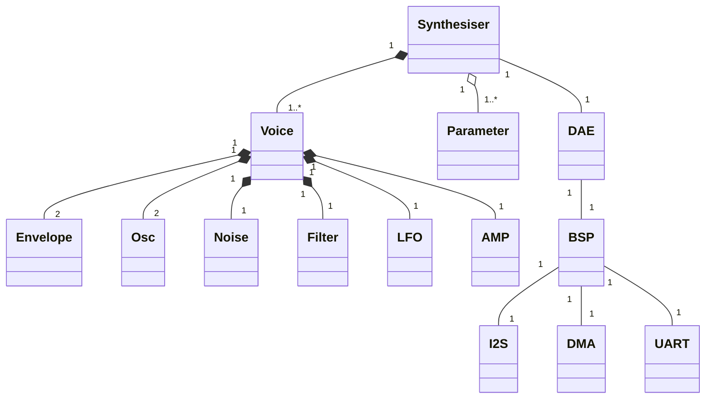

# Frugi Synthesizer

Frugi (meaning "frugal" or "stingy") is a beginner-friendly virtual analog synth for microcontrollers. Perfect for makers wanting to dip their toes into embedded audio!

While Frugi is fully functional, it's designed more as a learning tool than a polished commercial product.

Out of the box, it supports these boards:
- STM32F411-Generic (the "blackpill" board)
- STM32F411-Discovery board

By looking at how these are implemented, you should be able to add support for your favorite board too.

## Why C Instead of C++?

Frugi is written in plain C using the STM LL driver library instead of C++ or Arduino-style code. 

While Arduino has made microcontrollers super accessible (which is awesome!), outside that ecosystem most embedded systems actually run on C. Learning to work with straight C opens up a whole world of microcontrollers beyond the Arduino family, and gives you deeper control over what's happening under the hood. 

Don't worry though - we've kept things as clear and approachable as possible!

## What Can This Synth Do?

- **It's Polyphonic!**
  - Play up to 8 notes at once (on the STM32F411)
  - Smart voice stealing when you play more notes than available voices
  - Responds to how hard you hit the keys (velocity)

- **Sound Generation**
  - Two oscillators per voice with classic waveforms (saw, triangle, pulse)
  - Detune oscillators for thick, lush sounds
  - Adjust pulse width for those hollow, reedy tones
  - Built-in noise generator (white and pink noise)

- **Sound Shaping**
  - Multi-mode filter (Low Pass, Band Pass, High Pass)
  - Choose between gentler (12dB/oct) or steeper (24dB/oct) filter slopes
  - Filter saturation for some analog-style warmth
  - Control filter cutoff with LFO, envelope, or your MIDI notes

- **Modulation**
  - Dedicated LFO (inspired by the Yamaha CS20M) with 5 waveforms
  - Two envelope generators (one for volume, one for modulation)
  - Flexible envelope modes (normal, biased, inverted, biased inverted)

- **Control**
  - MIDI control over parameters (via serial RX, MIDI interface needed)
  - Automate parameters over time
  - Note velocity and keyboard tracking

## Provides a Digital Audio Engine (DAE)

A lightweight, real-time audio processing engine built on FreeRTOS. Designed for resource-limited microcontrollers, it gives you the foundation for creating all sorts of audio projects.

- Double-buffered design for smooth, glitch-free audio
- Works with FreeRTOS for reliable timing
- Efficient ping-pong buffer system
- Built-in MIDI parser (receives MIDI 1.0 messages)
- Parameter system for storing settings
- Test tone generator to make sure your hardware is working

## Includes Board Support Package (BSP)

The BSP handles all the hardware stuff so you can focus on making cool sounds:

- Sets up system clocks for you
- Configures the floating-point unit for faster audio math
- Gets LEDs, buttons, and debug pins working
- Manages the audio interface (works at 44.1kHz, 48kHz, or 96kHz)
- Handles audio data transfer without eating up CPU time
- Sets up MIDI input (at the standard 31250 baud rate)

If you're using a J-Link probe, you also get:
- Real-time debugging with RTT
- Performance measurement tools

### How It All Fits Together


```mermaid
classDiagram
  %% Synth
  Synthesiser "1" *-- "1..*" Voice
  Synthesiser "1" o-- "1..*" Parameter 
  Synthesiser "1" -- "1" DAE 

  %% Voice
  Voice "1" *-- "2" Envelope
  Voice "1" *-- "2" Osc
  Voice "1" *-- "1" Noise
  Voice "1" *-- "1" Filter
  Voice "1" *-- "1" LFO 
  Voice "1" *-- "1" AMP


  %% DAE
  DAE "1" -- "1" BSP
  BSP "1" -- "1" I2S
  BSP "1" -- "1" DMA 
  BSP "1" -- "1" UART
```

Want to learn more? Check out:

1. [BSP - Board Support Package](docs/bsp.md)
2. [DAE - Digital Audio Engine](docs/dae.md)
3. [Frugi - Synthesiser](docs/frugi.md)

## Getting Started

First, grab the code:

```bash
git clone https://github.com/ydigikat/frugi.git 
```

### What You'll Need

You probably already have the STM32 toolchain if you're checking out this project, but just in case:
You'll need either the `stm32cubeclt` command line tools or the `STM32CubeIDE`. The project files are set up for the command line tools.

When this was written, I was using version 1.18.0, installed at:
- `/opt/st/stm32cubeclt_1.18.0` (Linux)
- `C:\ST\stm32cubeclt_1.18.0` (Windows)

You might need to update some paths in these files to match your setup:
- `frugi/cmake/stm_arm_gcc.cmake`

If you're using VS Code, also check:
- `frugi/.vscode/launch.json`
- `frugi/.vscode/tasks.json`

### Using VS Code (The Easy Way)

VS Code is the simplest way to work with Frugi. Launch files and task configurations are ready to go for both Windows and Linux.

Make sure to open VS Code from the main `frugi` folder!

You'll need these VS Code extensions:

| Extension | Author |
| ------ | ------ |
| Cortex-Debug (for debugging only) | marus25 | 
| CMake Tools | Microsoft | 
| C/C++ Extension Pack | Microsoft |
| Embedded Tools | Microsoft |

### Setting Up the Project

From the command palette (Ctrl+P), run:
- `CMake: Select Configure Preset` (pick debug or release)
- `CMake: Delete Cache & Reconfigure`

### Building the Project

From the command palette:
- `CMake: Clean Rebuild` or `CMake: Build`

### Uploading to Your Board

You'll need either:
- An ST-Link probe
- A J-Link probe

We've included tasks for both (press Ctrl+Shift+J to see the task list):
- J-Link Flash (Linux)
- J-Link Flash (Win)
- ST-Link Flash (Linux)
- ST-Link Flash (Win)

These tasks look for the STM32 tools in specific folders - check the paths in `.vscode/tasks.json` if you run into issues.

You can also use STM32CubeIDE for flashing if you prefer.

### Debugging

Launch configurations for debugging are in the `.vscode/launch.json` file:
- JLink-Debug (Linux)
- JLink-Debug (Win)
- STLink-Debug (Linux)
- STLink-Debug (Win)

Getting debugging working in VS Code can sometimes be tricky, but these configurations work for me. If you have trouble, there's plenty of help online.

### Building from the Command Line

If you prefer terminal commands:

```bash
mkdir build
cmake --preset=debug
cmake --build --preset=debug
```

Use `--preset=release` for an optimized build. Note that debug builds are limited to 3-voice polyphony.

I don't include specific flashing instructions for command line builds, as they'll depend on what hardware programmer you're using.

## License

MIT License - Copyright (c) 2025 YDigiKat

## System Requirements

- STM32F411 Microcontroller (Cortex M4F)
- Audio DAC interface (I2S)
