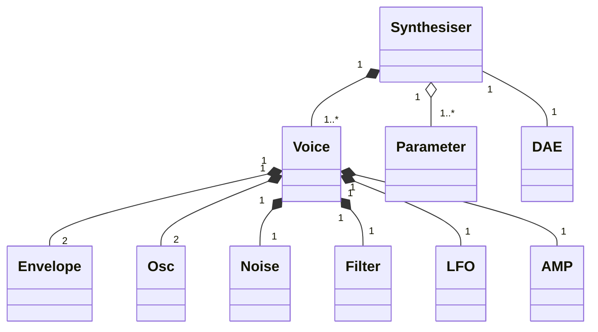

# Frugi Synthesizer

A virtual analog synthesizer implementation for STM32F411 embedded systems.

*IMPORTANT*  This project is by no means finished or polished.  It serves only to demonstrate how to use the DAE and as a workbench for exploring audio synthesis.

## Overview

Frugi is a polyphonic virtual analog synthesizer designed to run on microcontrollers using FreeRTOS. It provides an introductory synthesis engine with features typically found in hardware synthesizers, implemented for resource-constrained environments.

## Features

- **Polyphonic Architecture**:
  - 6 voices (limits to 3 when debugging)
  - Voice stealing and intelligent voice allocation
  - Velocity and note tracking

- **Sound Generation**:
  - Dual oscillators with multiple waveforms (saw, triangle, pulse)
  - Oscillator detuning, and pulse width modulation
  - White and pink noise generator

- **Signal Processing**:
  - Multi-mode filter (Low Pass, Band Pass, High Pass)
  - 2-pole and 4-pole filter slopes (12dB/oct and 24dB/oct)
  - Filter saturation and resonance
  - Filter cutoff modulation via LFO, envelope, and MIDI note

- **Modulation**:
  - Dedicated (Yamaha CS20M style) LFO with multiple waveform options
  - 5 LFO waveforms (triangle, saw, reverse saw, square, sample & hold)
  - Dual RC envelope generators (amp and mod)
  - Envelope modes (normal, biased, inverted, biased inverted)

- **Control**:
  - MIDI control via CC mappings
  - Preset/patch loading
  - Parameter automation
  - Note velocity and key tracking

## Architecture


### Domain Model


```mermaid
classDiagram
  %% Synth
  Synthesiser "1" *-- "1..*" Voice
  Synthesiser "1" o-- "1..*" Parameter 
  Synthesiser "1" -- "1" DAE 

  %% Voice
  Voice "1" *-- "2" Envelope
  Voice "1" *-- "2" Osc
  Voice "1" *-- "1" Noise
  Voice "1" *-- "1" Filter
  Voice "1" *-- "1" LFO 
  Voice "1" *-- "1" AMP
```

### Signal Flow

Frugi is built with a modular design where each component has a clear responsibility.  The audio rate signals run at sample rate (48kHz) whereas the Control Rate signals run at the block rate, that is every 128 samples.

```
               ┌───────────────┐
               │ frugi_synth   │ (Top-level synthesizer control)
               └───────┬───────┘
                       │
                       ▼
               ┌───────────────┐
               │ frugi_voice   │ (Voice management)
               └───────┬───────┘
                       │
           ┌───────────┴───────────┐
           │                       │
┌──────────▼─────────┐    ┌────────▼────────┐
│ Audio Rate         │    │ Control Rate    │
├────────────────────┤    ├─────────────────┤
│  - frugi_osc       │    │  - frugi_env_gen│
│  - frugi_noise     │    │  - frugi_lfo    │
└──────────┬─────────┘    └────────┬────────┘
           │                       │
           ▼                       ▼
 ┌─────────────────┐     ┌─────────────────┐
 │  frugi_filter   │ ◄── │ Modulation      │
 └────────┬────────┘     └─────────────────┘
          │
          ▼
 ┌─────────────────┐
 │   frugi_amp     │
 └────────┬────────┘
          │
          ▼
     Audio Output
```

1. **Voice Allocation**: When a MIDI note is received, the synth finds an available voice or steals the oldest one.
2. **Oscillators**: Each voice has two oscillators that generate the raw waveforms.
3. **Mixer**: The oscillator outputs and noise are mixed together.
4. **Filter**: The mixed signal passes through a multi-mode filter with modulation.
5. **Amplifier**: The filtered signal is shaped by the amplitude envelope and final volume.
6. **LFO & Envelopes**: Provide modulation to various parameters.

## Implementation Details

- **Embedded Focus**: Optimized for real-time performance on microcontrollers.
- **FreeRTOS Integration**: Uses FreeRTOS for memory management and task scheduling.
- **Fixed-Point Optimization**: Fast math operations for audio processing.
- **Memory Management**: Efficient buffer allocation and voice handling.
- **Parameter System**: Centralized parameter management for all modules.

## Parameters

- **Oscillators**: Waveform, octave, semitone, detune, level, modulation
- **Filter**: Cutoff, resonance, mode, saturation, envelope amount, LFO depth
- **Envelopes**: Attack, decay, sustain, release, mode, tracking
- **LFO**: Rate, mode, waveform
- **Amp**: Volume, pan, modulation

## Digital Audio Engine

Refer: [DAE README.md](source/dae/README.md)

## Building and Integration

The Frugi engine demonstrates how a synthesiser is integrated into a larger project making use of the DAE audio engine.

1. FreeRTOS for memory management
2. DSP math utilities (provided in the codebase)
3. Audio I/O driver integration
4. MIDI interface for control
5. DAE audio engine.
6. Board support files.

Clone the source repository, note that you need the ```dae``` submodule so make sure you use the --recursive flag.  See ```git``` documentation for other ways of doing this.

```bash
git clone https://github.com/ydigikat/frugi.git --recursive
```

#### Using VS Code

Using VS Code is the easiest way to work with the project.  There are ```launch.json``` and ```tasks.json``` files provided for building and debugging on both Windows and Linux, with ST-Link or J-Link probes.

Make sure you start VS Code in the top-level (frugi) folder.

You will need the following VS Code extensions installed:

| Plugin | Author |
| ------ | ------ |
| Cortex-Debug (only required for debugging) | marus25 | 
| CMake Tools | Microsoft | 
| C/C++ Extension Pack | Microsoft |
| Embedded Tools | Microsoft |

#### Configuring the tool chain

Use the command palette (```ctrl+P```) to run the following commands:

- ```CMake: Select Configure Preset```  (choose debug or release)
- ```CMake: Delete Cache & Reconfigure```


#### Building

Use the command palette (```ctrl+P```) to run the following command:

- ```CMake: Clean Rebuild``` or ```CMake: Build```

#### Programming (flashing) the MCU

To program or debug the MCU you will need one of:
- ST-Link probe
- J-Link probe

Tasks are provided for this, see the ```tasks.json``` file in the ```.vscode``` folder:

- J-Link Flash (Linux)
- J-Link Flash (Win)
- ST-Link Flash (Linux)
- ST-Link Flash (Win)

Press ```Ctrl+Shift+J``` to bring up the task list.

These use the **stm32cubeclt** command line tools which need to be located in the folders specified in the ```tasks.json``` file.  You can of course change these.  

You can use an installation of **STM32CubeIDE** instead for this if you prefer, you'll need to change the paths to point at the tools located in your installation of the CubeIDE.

#### Debugging

The ```launch.json``` file contains launch configurations for both J-Link and ST-Link probes:

- JLink-Debug (Linux)
- JLink-Debug (Win)
- STLink-Debug (Linux)
- STLink-Debug (Win)

Again these contain paths that point specifically to an installation of the **stm32cubeclt** command line tools.  These need to be correct or debugging will not work.

Debugger setup in VS Code can be a brittle and frustrating process, the launch file provided works (for me) at the time of writing however your mileage may vary.  There is lots of guidance to be found (good and bad) on the internet if things don't work.

### Command Line Builds

Navigate to the ```frugi``` folder and run the commands:

```bash
mkdir build
cmake --preset=debug
cmake --build --preset=debug
```

Note: Use ```--preset=release``` for an optimised Release build. Debug builds are limited to 3 voice polyphony.

I don't provide specific instructions on how to flash or debug from the command line since this will be specific to the SWD/JTAG probe you are using.  Please consult the documentation for the probe.  I use the command line build only for my CI build server which neither flashes or debugs the device.


## Technical Requirements

- STM32F411 Microcontroller
- Sufficient RAM for voice buffers
- Floating-point capability (hardware)
- Audio DAC interface (I2S)


## Who am I?
I am what is impolitely, but totally correctly,  referred to as a "graybeard".

I've been an embedded engineer on and off for over 40 years.  I've worked in the early machine vision and robotics industry.  I've also worked on control systems for various communication systems including paging (remember that), railway ticketing systems and satellites. I worked with Motorola,Zilog, Hitachi, ARM and a swathe of now long-forgotten microcontrollers in that time.

These days I'm an architect and my main role is to draw pictures for others to do the coding, which is one of the reasons I do this, to keep my in and because like most programmers, I find hands-on coding both enjoyable and creative.

I'm also a musician, once classically trained, who had planned a musical career but was convinced by the wages in 1983 to switch career.  I've played and performed in various bands as a keyboardist until the early 2000s.  So I've worked with many of the vintage synthesisers that are so sought after today (and sadly sold my fair share of them for peanuts over the years - I badly miss my Yamaha CS20M and Juno 106).

Audio DSP is a hobby, it merges my two careers, something I find exciting and challenging.  As I head into retirement I need something to keep my brain active and this is ideal.  

So be warned, I may be further ahead on the learning pathway than some reading this but I don't claim to be a good, or even efficient, Audio DSP programmer.

Melbourne 2025.

## License

MIT License - Copyright (c) 2025 YDigiKat
