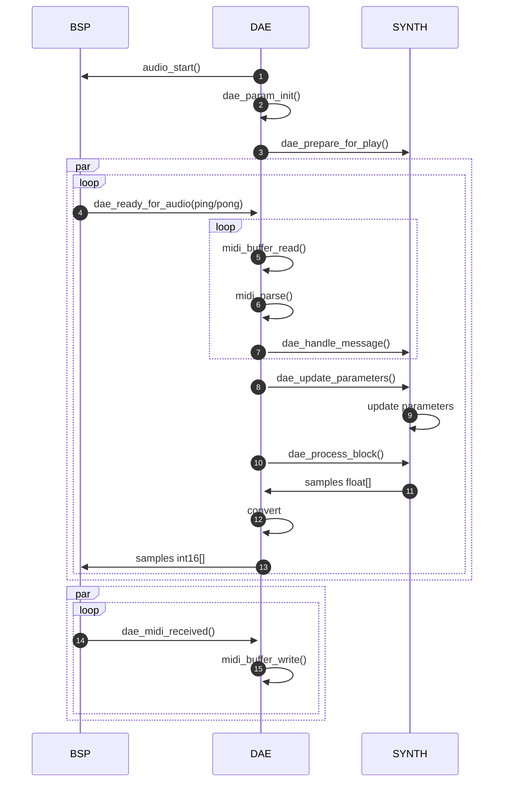

# Walking Through the DAE Code (dae.c)
### The Heart of Your Synthesizer
Let's take a tour through the Digital Audio Engine (DAE) code to gain an overview of how it works. 

Think of the DAE as the conductor of an orchestra - it doesn't make sound itself, but it coordinates everything to ensure beautiful music comes out.

### Setting Up the Stage
At the top of the file, we see some important settings:
```c
#ifndef DAE_IS_USING_MCLOCK
#define DAE_IS_USING_MCLOCK (0)
#endif

#ifndef DAE_SAMPLE_RATE
#define DAE_SAMPLE_RATE (48000)
#endif

#ifndef DAE_AUDIO_BLOCK_SIZE
#define DAE_AUDIO_BLOCK_SIZE (128)
#endif

#define DAE_AUDIO_BUFFER_SIZE (DAE_AUDIO_BLOCK_SIZE * 8)
```

These define how the audio system will run:

- Whether it uses a master clock for I2S
- The sample rate (48kHz by default)
- How many samples to process at once (128)
- The total buffer size (128 × 8 = 1024 samples)

### Memory for Sound
The DAE needs places to store audio data:

```c
static alignas(4) float left_buffer[DAE_AUDIO_BLOCK_SIZE];
static alignas(4) float right_buffer[DAE_AUDIO_BLOCK_SIZE];
static alignas(4) int16_t audio_buffer[DAE_AUDIO_BUFFER_SIZE];
```

- ```left_buffer``` and ```right_buffer``` hold floating-point samples for left and right channels
- ```audio_buffer``` is where the final formatted audio goes before heading to the hardware

### The Main Audio Thread
The real work happens in ```dae_task()```. Let's crack it open:

```c
static void dae_task(void *pvParameters)
{
  /* Starts the I2S and DMA peripherals */
  audio_start(audio_buffer, DAE_AUDIO_BUFFER_SIZE, DAE_SAMPLE_RATE, DAE_IS_USING_MCLOCK);

  /* Initialises the global parameter store */
  dae_param_init();

  /* Configures the sound source for playing */
  dae_prepare_for_play(get_actual_fsr(DAE_SAMPLE_RATE, DAE_IS_USING_MCLOCK), 
                       DAE_AUDIO_BLOCK_SIZE, &midi_in.channel);

  while (1)
  {
    /* Sleep until the DMA signals us to refresh a buffer */
    ulTaskNotifyTake(pdTRUE, portMAX_DELAY);
    
    /* Process MIDI messages */
    uint8_t byte;
    while (midi_buffer_read(&byte))
    {
      struct midi_msg *msg = midi_parse(&midi_in, byte);
      if (msg != NULL)
      {
        dae_handle_midi(msg);
      }
    }

    /* Update changed parameters */
    if (dae_param_changed)
    {
      dae_update_parameters();
      dae_param_changed = false;
    }

    /* Generate audio */
    dae_process_block(left_buffer, right_buffer, DAE_AUDIO_BLOCK_SIZE);

    /* Select the buffer to output */
    int16_t *restrict ptr = (active_buffer == PING) ? 
                           audio_buffer : 
                           audio_buffer + DAE_AUDIO_BUFFER_SIZE / 2;

    /* Copy samples to audio buffer in I2S format */
    for (int i = 0; i < DAE_AUDIO_BLOCK_SIZE; i++)
    {
      int32_t l_sample = left_buffer[i] * INT32_MAX;
      int32_t r_sample = right_buffer[i] * INT32_MAX;

      *ptr++ = (int16_t)(r_sample >> 16);
      *ptr++ = (int16_t)(r_sample);
      *ptr++ = (int16_t)(l_sample >> 16);
      *ptr++ = (int16_t)(l_sample);
    }
  }
}
```

Here's what happens:

1. **Startup**: DAE initializes the audio hardware, parameter store, and your synthesizer
2. **Main Loop**: The task then enters an infinite loop that:
    - Sleeps until awakened by the audio hardware
    - Processes any waiting MIDI messages
    - Updates any parameters that changed
    - Calls your synth code to generate audio
    - Converts and formats the audio for the hardware

### The Ping-Pong Buffer System
When the audio hardware finishes sending one buffer, it triggers this function:
```c
void dae_ready_for_audio(enum buffer_idx buffer_idx)
{
  BaseType_t higher_task_woken = pdFALSE;

  active_buffer = buffer_idx;

  /* Notify the DAE task that it is ready to process audio */
  vTaskNotifyGiveFromISR(dae_task_handle, &higher_task_woken);

  /* If the DAE task has higher priority, yield */
  if (higher_task_woken)
  {
    portYIELD_FROM_ISR(higher_task_woken);
  }
}
```
This is the "ping-pong" system in action:

The hardware tells us which buffer it just finished (PING or PONG)
We wake up the audio task to fill that buffer with fresh audio
Meanwhile, the hardware keeps playing from the other buffer

### Test Tone Generator
The DAE includes a simple tone generator for testing:

```c
static void generate_test_tone(float *restrict left, float *restrict right, size_t block_size)
{
  for (size_t i = 0; i < block_size; i++)
  {
    if (test_tone_phase > 1.0f)
    {
      test_tone_phase -= 1.0f;
    }

    float angle = -1.0f * (test_tone_phase * 2.0f * DAE_PI - DAE_PI);
    float y = test_tone_b_coeff * angle + test_tone_c_coeff * angle * fabsf(angle);

    left[i] = (test_tone_p_coeff * (y * fabsf(y) - y) + y);
    right[i] = left[i];
    test_tone_phase += test_tone_inc;
  }
}
```

This generates a 440Hz sine wave approximation using a common algorithm that's more efficient than using the standard sine function. It's a great way to test if your audio hardware is working correctly.

### Detailed flow sequence
This rather fearsome looking diagram shows the calls made between the BSP, DAE and Synthesiser.  You can skip this, if you like, the rest of the document will still make sense.



|# |Description|
|--|----------|
|1 | The DAE starts the audio hardware running by calling the low-level board driver function|
|2 | The DAE creates the parameter store which is empty at this point|
|3 | The DAE initialises the synthesiser, passing it key parameters such as block size and FSR, the synthesiser will populate the parameter store with values|
|4 | The DMA controller calls the DAE to inform that a buffer has just been sent, the buffer needs to be refreshed with new audio (buffer swap).|
|5 | The DAE checks for pending MIDI data in the MIDI ring buffer|
|6 | The DAE parses all bytes in the ring buffer into complete messages, incomplete messages are left for next cycle|
|7 | The DAE calls the synth passing it each parsed message for processing, these can be MIDI note events or CC messages and can result in parameters needing to be updated.|
|8 | The DAE checks for any parameter changes and signals to the synth that it needs to update if so|
|9 | The synth updates the parameter cache used by voices, reading from the DAE owned store|
|10 | The DAE calls synth to request a block of audio samples|
|11 | The synth returns a buffer of float samples|
|12 | The DAE converts these to 16-bit integers and places in the requested buffer|
|13| The DMA controller uses refreshed buffer on next buffer swap|
|14| The UART calls the DAE when a data byte is received|
|15| The DAE accumulates the data bytes in the MIDI ring buffer|


